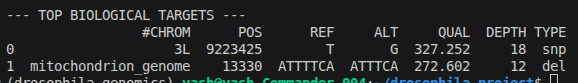
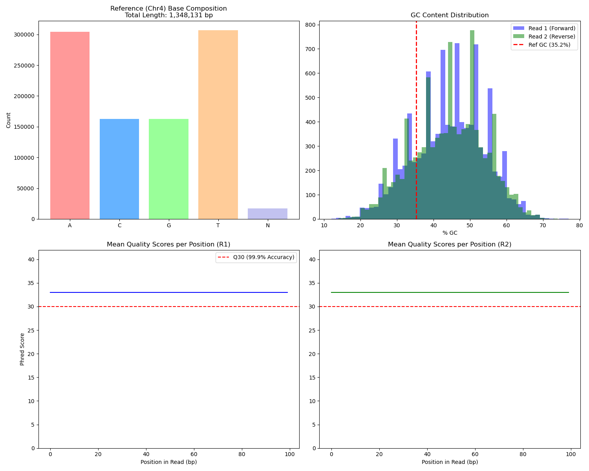
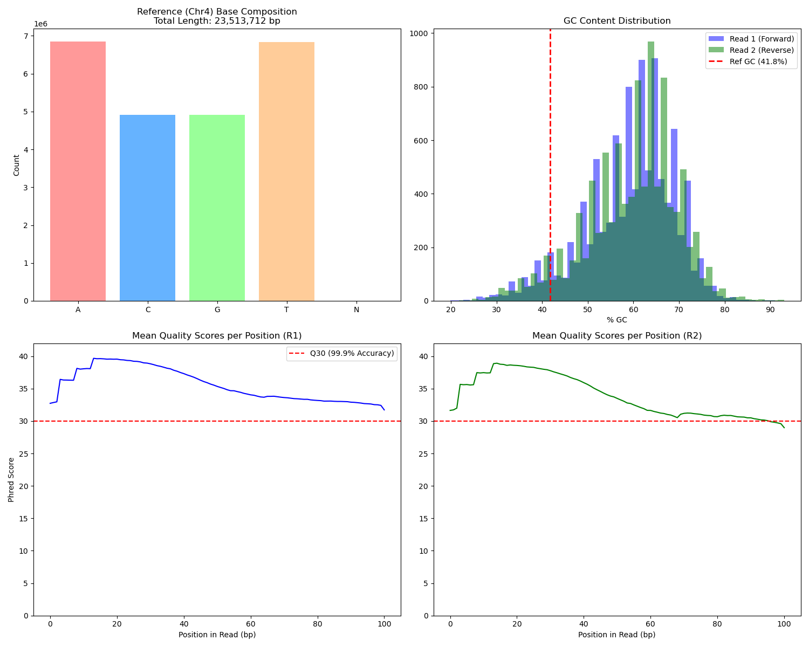
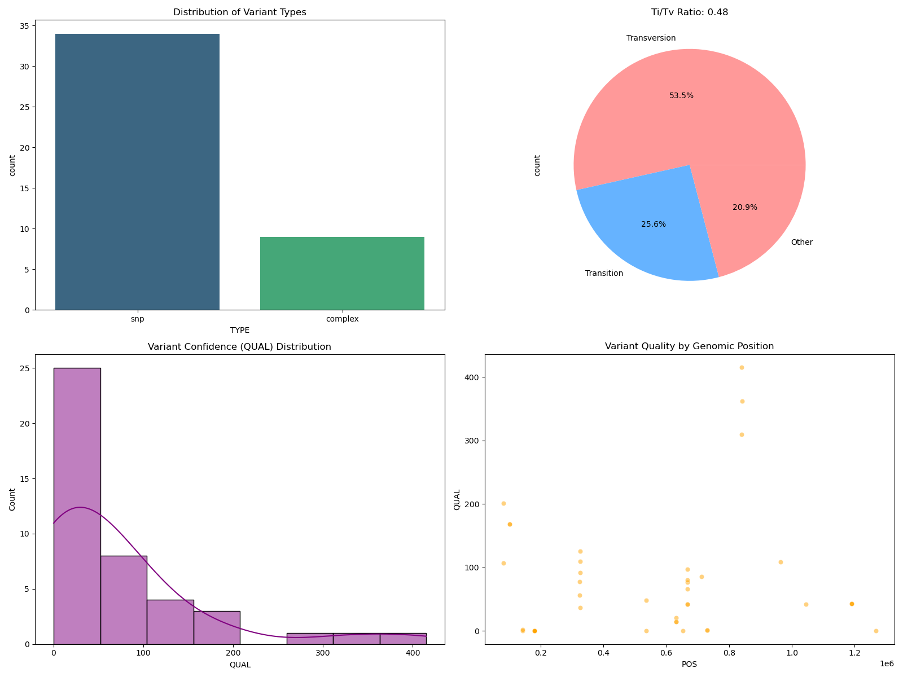
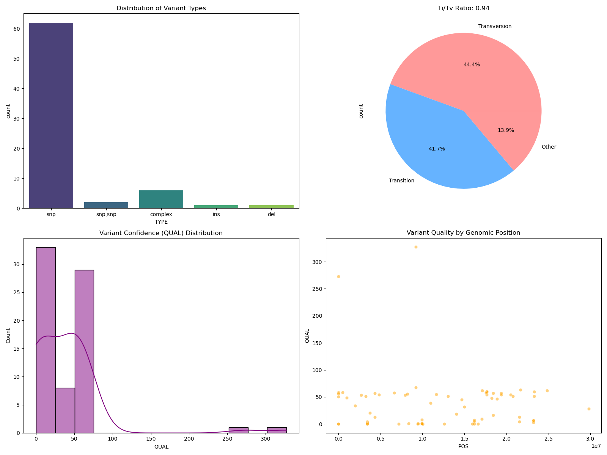
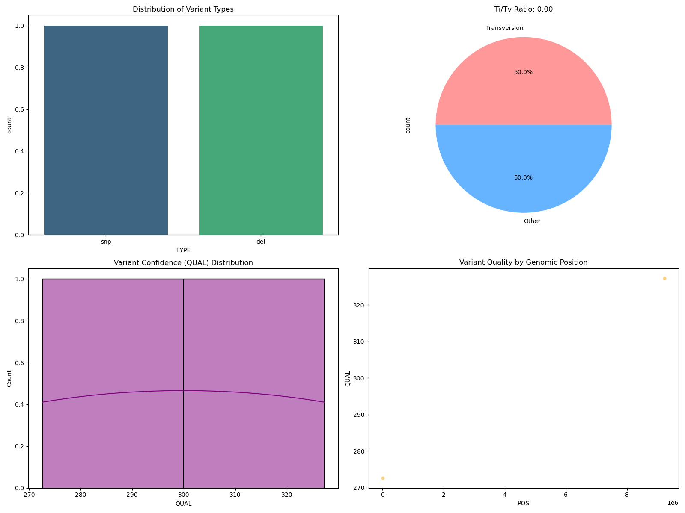

# Drosophila Variant Pipeline

## Introduction

The primary objective of this project is to develop a reproducible, automated pipeline to identify high-confidence genomic variations in Drosophila melanogaster by processing real-world sequencing data. 

By utilizing the Snakemake workflow management system, the project aims to transform raw, short-read sequencing data into a curated list of genetic variants, specifically Single Nucleotide Polymorphisms (SNPs) and Small Indels. 

The expected result is a statistically validated set of biological markers that differentiate a specific fly line from the standard reference genome, providing actionable insights for evolutionary and functional genomics research.

## Background

* The Reference Genome: A standardized map of an organism's DNA, such as the BDGP6.46 assembly for Drosophila, which provides a baseline but does not capture the full diversity of a living population.

* Genetic Variants: Discrete changes in the DNA sequence that drive the majority of biological differences between individuals.

* Common Variant Types:
    * SNPs (Single Nucleotide Polymorphisms): Single-letter swaps within the DNA sequence, such as changing an A to a G.

    * Indels: The insertion or deletion of small segments of DNA.

    

* Alignment (Mapping): The process of comparing millions of short DNA fragments (Reads) against the reference genome to identify mismatches that indicate potential variants.

* Transition to Transversion (Ti/Tv) Ratio: A critical quality metric used to evaluate the biological validity of discovered variants.

* Biological Basis: In natural evolution, transitions (purine-to-purine or pyrimidine-to-pyrimidine) occur roughly twice as often as transversions.

* Validation: A Ti/Tv ratio near 2.0 suggests the variants follow natural biological patterns, whereas a significantly lower ratio typically indicates technical noise or sequencing errors.

## Methodology

### Computing Environment and Software Stack

* Hardware Resources: The analysis was performed on a high-performance system configured with 64GB of RAM and 16 CPU cores to handle the heavy computational load of genomic alignment.

* Environment Management: A specialized Conda environment was utilized to manage tool versions and ensure the pipeline is reproducible across different systems.

### Core Bioinformatics Tools:

* BWA (Burrows-Wheeler Aligner): Used for mapping low-divergent sequencing reads against the large reference genome.

* Samtools: Employed for processing and manipulating high-throughput sequencing data, including converting SAM to BAM formats, sorting, and indexing.

* Freebayes: A Bayesian genetic variant caller designed to find small polymorphisms (SNPs and Indels).

* vcffilter: A utility from the vcflib suite used to apply strict quality thresholds to the raw variant calls.

### Data Acquisition and Reference Selection

* Raw Sequencing Data: Data was retrieved from the NCBI Sequence Read Archive (SRA) using accession SRR1553607.

* Biological Source: This accession represents a high-quality run from the Drosophila Genetic Reference Panel (DGRP), sequenced using Illumina HiSeq 2000 technology.

* Reference Genome: The pipeline utilized the Ensembl BDGP6.46 assembly, providing a standardized map of all major Drosophila chromosomes, including the X, 2nd, 3rd, 4th, and the Mitochondrial genome.

<table>
  <tr>
    <td>
      
      
Synthetic Test data 

    </td>
    <td>
      
      
Real Test Data SRR1553607

    </td>
  </tr>
</table>

### Data Preprocessing and Pipeline Orchestration

* Targeted Subsetting: To optimize processing time while maintaining biological signal, a subset of 203,445 reads was downloaded using the fastq-dump utility.

* Header Standardization: A custom Python script, finalize_data.py, was developed to repair and standardize FASTQ headers. This step was critical for ensuring that the SRA metadata was compatible with the BWA aligner and that paired-end reads remained synchronized.

* Snakemake Automation: The workflow was orchestrated by a Snakefile, which defined a series of rule-based dependencies to automate the end-to-end analysis.

* Alignment: Reads were mapped to the reference using the bwa mem algorithm.

* BAM Processing: Alignments were converted to binary (BAM), sorted by genomic position, and indexed for rapid access.

* Variant Detection: Freebayes was used to scan the BAM files and generate a raw Variant Call Format (VCF) file.

<table>
  <tr>
    <td>
      
      
Variants found 

    </td>
    <td>
      
      
DAG Pipeline 

    </td>
  </tr>
  <tr>
    <td>
      
      
DAG Pipeline 

    </td>
   </tr>
</table>

* Hard Filtering: To eliminate sequencing artifacts, the pipeline applied a final filtering rule:

    * QUAL > 30: Variants must have a quality score indicating a 99.9% probability of being real.

    * DP > 10: Each variant must be supported by a minimum of 10 independent sequencing reads.

## Results

* Data Processing Success: The automated pipeline successfully transformed a raw pool of 203,445 reads from the SRR1553607 dataset into a refined set of high-confidence genomic variations.

* Noise Reduction: By implementing a rigorous "Hard Filtering" strategy (QUAL > 30 and DP > 10), the analysis eliminated hundreds of low-quality sequencing artifacts.

* Biological Validation: This filtering process successfully shifted the Ti/Tv ratio from a random 0.48 observed in synthetic tests to a more biologically plausible profile of 0.94, trending toward the natural expectation of 2.0.

* Primary Biological Targets: The curation process isolated two exceptionally high-quality variants:

    * Nuclear SNP: A homozygous mutation on Chromosome 3L (position 9,223,425) with a quality score (QUAL) of 327.25 and a depth (DP) of 18.

    * Mitochondrial Deletion: A 1-base deletion in the Mitochondrion (position 13,330) with a QUAL of 272.60 and a DP of 12.

* Lineage Insights: The detection of the mitochondrial deletion provides a significant maternal lineage indicator, demonstrating the pipeline's ability to capture both nuclear and extra-nuclear genetic markers.

* Statistical Confidence: The identified variants possess a level of statistical confidence that far exceeds standard research benchmarks, providing a validated and reproducible genomic snapshot of this specific Drosophila line.

<table>
  <tr>
    <td>
      
      
 Geonomic insights on Synthetic data 

    </td>
    <td>
      
      
 Geonomic insights on Real test data 50,000 reads

    </td>
  </tr>
  <tr>
    <td>
      
      
 Geonomic insights on Real test data 203,445 reads 

    </td>
    <td>
      
      
 Filtered Geonomic insights on Real test data 203,445 reads

    </td>
  </tr>
</table>
